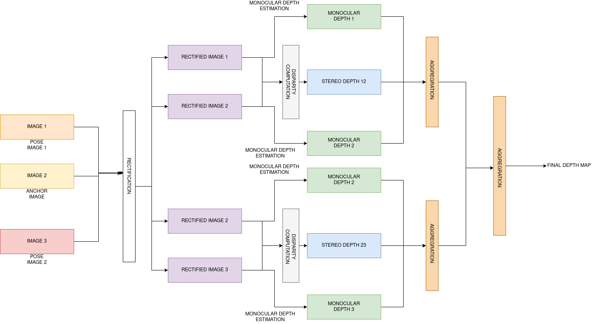

# Depth Estimation from uncalibrated images

## About

This is a CLI tool to estimate depth of an anchor image given two pose images. These images can be uncalibrated and unstructured in charateristic. A pipeline of already existing
tools has been used in this tool to estimate the depth from three unstructured images. The overall architecture of the tool is shown above.

## Getting Started


### Prerequisites
You need Python 3.x and Conda package manager to run this tool

### Installation
For installing this tool with pretrained model, follow the steps below :
1. Clone this repository `git clone https://github.com/tre3x/Depth-Estimation.git`
2. Install the neccessary dependencies by executing `conda env create -f environment.yml`

## Usage

To run the tool on local machine, follow the steps in the **Installation** section.
After setting up the environment, Run :
```bash
python depthestimate.py --leftimgpath 'path/to/left/image' --anchorimgpath 'path/to/anchor/image' --rightimgpath 'path/to/right/image' --stereo_model 'MSNet2D' --monocular_encoder 'large07' --stereo_ckpt_path 'checkpoint/to/stereo/model' --monocular_checkpoint_path 'checkpoint/to/monocular/depth/estimation/model'

```
- `<path/to/left/image>` - Path to pose left image.
- `<path/to/anchor/image>` - Path to pose anchor image.
- `<path/to/right/image>` - Path to pose right image.
- `<stereo_model>` - Type of stereo model to be used in the tool. (MSNet2D/MSNet3D) Default - MSNet2D
- `<monocular_encoder>` - Type of monocular depth encoder to be used in the tool. (KITTI/NYU) - Default - NYU
- `<checkpoint/to/stereo/model>` - Path to stereo depth estimation model. Downloadable from [here](https://drive.google.com/file/d/1Y2Q7qcwjls0ThVpQFvFy3nXR0TBCal9y/view)
- `<checkpoint/to/monocular/depth/estimation/model>` - Path to monocular depth estimation model. Downloadable from [here](https://drive.google.com/drive/folders/14USfGE5gDJhPGAVUWuALdLqICYLSWRjL?usp=sharing)

  To get help about the syntax format : `python depthestimate.py --help`

## Reference

The implementation of the code is based on [MobileStereoNet](https://arxiv.org/pdf/2108.09770.pdf) and [NewCRFS](https://arxiv.org/abs/2203.01502).

